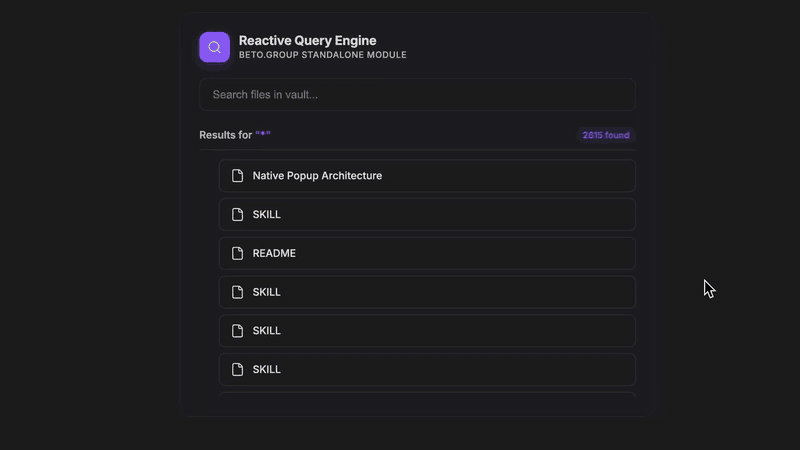
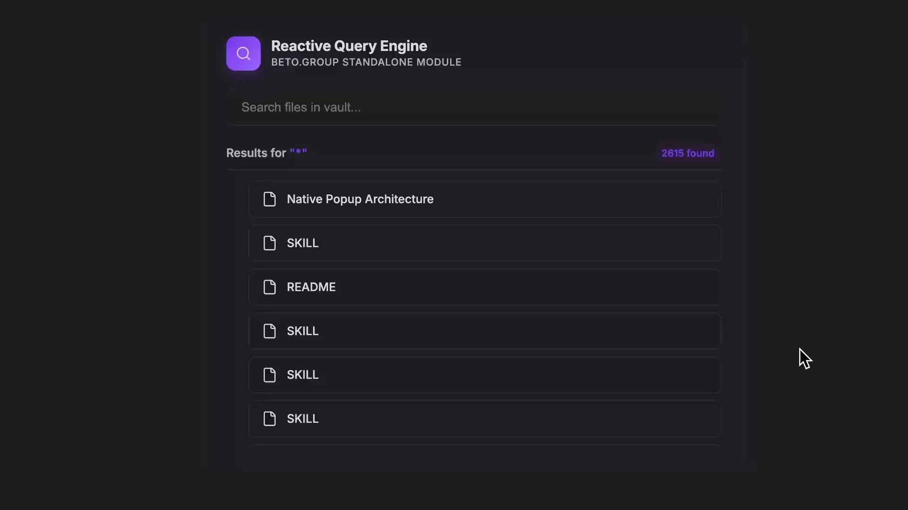

  
  
  <h1 align="center">SEARCH QUERY</h1>
  <h3 align="center"> Reactive Dynamic Search Engine </h3>

  <!-- TOP PURPLE LINKS -->
  
  
  
   
  <!-- BOTTOM GOLD TAXONOMY -->
  
  
  
  

  

    <i> A minimal, real-time search component that filters vault files by name using a text input. </i>
  

  

Welcome to **Search Query**, a premium, modular query component engineered as an educational and practical reference for implementing real-time, reactive vault searching inside Obsidian using Datacore.

---

## Quick Start

To start trying Search Query today:
1. **Download the Repository**: Clone or download this repository directly into any folder inside your Obsidian vault.
2. **Install Datacore**: Ensure you have the **Datacore** plugin installed and enabled in Obsidian.
3. **Open the Entry Note**: Open the **`SEARCH QUERY.md`** note inside Obsidian to launch the component!

---

## Features

### Blazing Fast Architecture
*   **Live Reactive Search**: Features a text input box bound to the component state for real-time keystroke processing.
*   **Dynamic Query Generation**: Constructs a Datacore query string on the fly using `@page and $name.contains("...")` expressions.
*   **Graceful Conditional Layouts**: Displays result list cards with micro-animations when matches are found, and a fallback view when there are no matches.

---

## Directory Index

| File | Description |
| :--- | :--- |
| [SEARCH QUERY.md](SEARCH%20QUERY.md) | The main entry point designed to be loaded inside Obsidian canvases or workspace leaves. |
| [src/App.jsx](src/App.jsx) | Main bootstrap application loader that resolves and wires the underlying views. |
| [src/SearchQuery.component.jsx](src/SearchQuery.component.jsx) | High-fidelity React query layout component filtering notes by name content. |
| [METADATA.md](METADATA.md) | Packaging manifest outlining indexing, target, and security configurations. |
| [CONTRIBUTION.md](CONTRIBUTION.md) | Contributor architecture standards and local compilation guidelines. |
| [LICENSE.md](LICENSE.md) | MIT open-source license. |
| [assets/image/preview_1.webp](assets/image/preview_1.webp) | High-fidelity static preview image of the component. |
| [assets/videos/preview.gif](assets/videos/preview.gif) | Walkthrough loop walkthrough GIF. |

---

## Previews

| Card Layout | Interactive Search Explorer |
| :---: | :---: |
|  |  |

---

## Contributors
- beto.group
